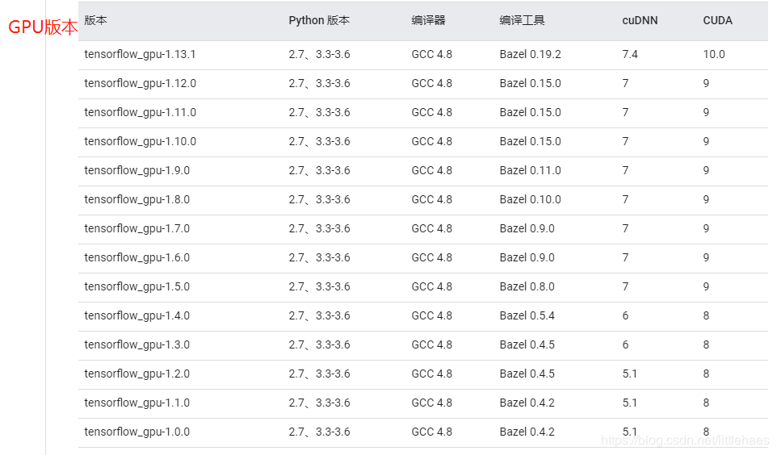

# Linux深度学习环境配置（Linux16.04+nvidia430+cuda8.0.44+cudnn6+anaconda3-5.0.0+tensorflow1.4.0+keras2.1.5）


## 写在前面

请务必注意tesouflow-gpu与cuda、cudnn的匹配问题！！！  
请务必注意tesouflow-gpu与cuda、cudnn的匹配问题！！！  
请务必注意tesouflow-gpu与cuda、cudnn的匹配问题！！！  
重要的事情说三遍，笔者在安装时因版本问题而踩了不少坑。  

  


  [原图博客地址](https://blog.csdn.net/littlehaes/article/details/100575694)  
                        
  
此处选用如图：

  [原图博客地址](https://blog.csdn.net/u014797226/article/details/80229887)


## 步骤
(主要参考此帖[Ubuntu16.04 + 1080Ti深度学习环境配置教程](https://www.jianshu.com/p/5b708817f5d8)，并默认安装好ubuntu16.04系统,且计算机为x86架构64位） 
### 1. 查看显卡是否支持cuda：[地址](https://developer.nvidia.com/cuda-gpus) 
  
  
### 2. 安装显卡驱动
<1>. 开机进入X桌面后，键盘上按下 ctrl + alt + F1，进入命令行模式。ubuntu有命令行模式和X桌面模式，安装驱动必须在命令行模式进行；


<2>. 输入用户名，回车，继续输入密码，回车确认；


<3>. 禁用X桌面服务，命令行输入：
```
sudo service lightdm stop
```
此命令将关闭桌面服务，现在已经不能进入桌面模式（重启电脑会重启桌面服务）； 


<4>. 禁用nouveau驱动。Ubuntu系统集成的显卡驱动程序是nouveau，我们需要先将nouveau从linux内核卸载掉才能安装NVIDIA官方驱动。
将nouveau添加到黑名单blacklist.conf中，linux启动时，就不会加载nouveau。接上步进行以下操作：
```
ll /etc/modprobe.d/blacklist.conf # 查看属性

sudo chmod 666 /etc/modprobe.d/blacklist.conf # 修改属性

sudo vi /etc/modprobe.d/blacklist.conf # 用vi编辑器打开
```
在文末添加如下几行：
```
blacklist vga16fb
blacklist nouveau
blacklist rivafb
blacklist rivatv
blacklist nvidiafb
```
修改并保存文件后，进行以下操作：
```
sudo chmod 644 /etc/modprobe.d/blacklist.conf # 将文件属性还原

sudo update-initramfs -u # 更新一下内核
```
重新启动计算机；  


<5>. 安装nvidia驱动（nvidia430）。打开终端，使用如下命令添加Graphic Drivers PPA:
```
sudo add-apt-repository ppa:graphics-drivers/ppa
sudo apt-get update
```
寻找合适的驱动版本:
```
ubuntu-drivers devices
```
如图所示，选择一个合适的版本：  

  

[原图博客地址](https://blog.csdn.net/10km/article/details/61191230)  

按ctrl+alt+F1进入tty文本模式，输入用户名和密码后：
```
sudo service lightdm stop # 关闭(图形)桌面显示管理器LightDM

sudo apt-get install nvidia-430 # 以430为例，安装驱动

sudo reboot # 重启
```  


<6>. 重启计算机，进入BIOS，在BIOS中禁用“安全启动”模式（secure boot），详情根据不同主板进行操作（否则第三方显卡驱动将无法被启动！）。
禁用后，重启系统后，执行下面的命令查看驱动的安装状态：
```
sudo nvidia-smi
```
---------------------------------------------------------------------

### 3. 安装cuda
<1>. 下载cuda（8.0.44），[下载地址](https://github.com/iMyGirl/imygirl.github.io/blob/master/Linux%E6%B7%B1%E5%BA%A6%E5%AD%A6%E4%B9%A0%E7%8E%AF%E5%A2%83%E9%85%8D%E7%BD%AE.md#cuda%E4%B8%8B%E8%BD%BD);


<2>. 请先在Terminal中安装以下依赖库：
```
sudo apt-get install freeglut3-dev
sudo apt-get install build-essential
sudo apt-get install libx11-dev
sudo apt-get install libxmu-dev 
sudo apt-get install libxi-dev 
sudo apt-get install libglu1-mesa 
sudo apt-get install libglu1-mesa-dev

```


<3>. 安装。安装过程中会提示你进行一些确认操作，首先是接受服务条款，输入accept确认，然后会提示是否安装cuda tookit、cuda-example等，均输入Y进行确定。但请注意，当询问是否安装附带的驱动时，一定要选N！我们在第一部分已经安装好最新的驱动，附带的驱动是旧版本的而且会有问题，所以不要选择安装驱动。
```
cd path # cd指到下载路径

sudo sh cuda_8.0.44_linux.run # 进行安装
```
注意： …symbolic link …选项选择Yes，否则没有/usr/local/cuda/，只有/usr/local/cuda8.0/  
  
    
    
<4>. 配置环境变量
打开终端，在文件/etc/profile的最后添加以下内容：
```
PATH=/usr/local/cuda/bin:$PATH
export PATH
```
保存后, 执行下列命令, 使环境变量立即生效：
```
source /etc/profile
```
在 /etc/ld.so.conf.d/新建文件 cuda.conf，并添加如下内容，进而保存：
```
/usr/local/cuda/lib64
```
执行下列命令使之立刻生效：
```
sudo ldconfig
```
打开终端，输入cuda，按2次”Tab键“，如果有弹出的命令提示，就说明环境配置成功。
  
    
    


<5>. 安装CUDA SAMPLES
为什么安装cuda samples?
一方面为了后面学习cuda使用，另一方面，可以检验cuda是否真的安装成功。如果cuda samples全部编译通过，没有一个Error（Warning忽略），那么就说明成功地安装了cuda。但如果没有通过编译，或者虽然最后一行显示PASS xxx，但是编译过程中有ERROR，请自行GOOGLE解决之后，再向下安装，否则失之毫厘谬以千里*！！！
make时，请使用make -j，可以最大限度的使用cpu编译，加快编译的速度。

```
# 切换到cuda-samples所在目录
# 注意，换成自己的路径
cd /home/xuezhisd/NVIDIA_CUDA-8.0_Samples
# 编译 make （安装命令 sudo apt-get install cmake)
make –j 
# 编译完毕，切换release目录
cd ./bin/x86_64/linux/release
# 检验是否成功
# 运行实例 ./deviceQuery
./deviceQuery 
# 可以认真看看自行结果，它显示了你的NVIDIA显卡的相关信息。
```
 
 ./deviceQuery执行结果如下图所示：  


[原图博客地址](https://blog.csdn.net/xuezhisdc/article/details/48651003)  


<6>. 验证nvcc  
重新打开终端，输入命令*nvcc --version*，如果已经安装了，会显示版本号；如果没有安装，按照提示完成安装。  

---------------------------------------------------------------------
  
  
### 4. 安装cudnn
<1>. 在Nvidia官网注册好帐号；

<2>. 下载cudnn6，[下载地址](https://github.com/iMyGirl/imygirl.github.io/blob/master/Linux%E6%B7%B1%E5%BA%A6%E5%AD%A6%E4%B9%A0%E7%8E%AF%E5%A2%83%E9%85%8D%E7%BD%AE.md#cudnn%E4%B8%8B%E8%BD%BD)，安装cudnn比较简单，简单地说，就是复制几个文件：库文件和头文件。将cudnn的头文件复制到cuda安装路径的include路径下，将cudnn的库文件复制到cuda安装路径的lib64路径下。
；  
进入CUDNN存放的文件夹，输入：
```
tar -xzf cudnn-8.0-linux-x64-v6.0.tgz

cd cuda

sudo cp lib64/* /usr/local/cuda/lib64/

sudo cp include/* /usr/local/cuda/include/

```

P.S. 有一种说法，要建立软连接，但笔者在这一步有报错，参考<https://blog.csdn.net/wanzhen4330/article/details/81704474>，一开始安成了cudnn7，后由cudnn7改为cudnn6,建立软链接的最后一步报错（so.7无法连接？。。。）  


<3>. 测试cudnn是否安装成功
到目前为止，cudnn已经安装完了。但是，是否安装成功了呢，还得通过下面的cudnn sample测试：
```
# 运行cudnn-sample-v2
tar –zxvf cudnn-sample-v2.tgz
cd cudnn-sample-v2
make
./mnistCUDNN
# 程序运行成功，说明cudnn安装成功。

```
---------------------------------------------------------------------
  
  
### 5. 安装anaconda
<1>. 下载anaconda(3.5.0.0)，[下载地址](https://github.com/iMyGirl/imygirl.github.io/blob/master/Linux%E6%B7%B1%E5%BA%A6%E5%AD%A6%E4%B9%A0%E7%8E%AF%E5%A2%83%E9%85%8D%E7%BD%AE.md#anaconda%E4%B8%8B%E8%BD%BD)；  


<2>. 命令行cd到安装包存放地址，输入：
```
sh Anaconda3-5.0.0-Linux-x86_64.sh
```
安装anaconda，一路输入Y，确认操作就行； 


<3>. 配置环境变量，命令行中输入：
```
sudo vi ~/.bashrc
```
在底部插入以下这一句：
```
export PATH=/home/ubuntu/anaconda3/bin:$PATH
```
保存并退出后，输入：
```
source ~/.bashrc
```
使设置生效。可以输入conda list python查看python版本，其它详细命令可以查看以下链接：[Anaconda使用总结](http://blog.leanote.com/post/braveapple/Anaconda%E4%BD%BF%E7%94%A8%E6%80%BB%E7%BB%93)

  
  
---------------------------------------------------------------------
  
  
### 6. pip安装Tensorflow与keras
<1>. 更换pip镜像源（可不进行更换，下载速度可能较慢）  

cd到根目录，命令行输入：
```
sudo mkdir .pip
```
新建一个名为“.pip”的文件夹。创建pip配置文件：sudo vi ~/.pip/pip.conf，在vi界面中插入以下这句话：
```
[global]
index-url = https://pypi.douban.com/simple
```
然后按esc键，按下“:wq”（注意不包含双引号，记得要包括冒号），然后回车退出。
即可把pip源更新为国内豆瓣镜像，可参考这篇文章：[pip 更换软件镜像源](https://www.jianshu.com/p/785bb1f4700d)；

<2>. 更换apt-get源（可不进行更换，下载速度可能较慢）  
参考[Ubuntu 14.04 更换阿里云源](https://www.jianshu.com/p/c0ca2d4ea589)  
备份旧版本：
```
sudo cp /etc/apt/sources.list /etc/apt/sources.list.bak #备份
```
修改文件：
```
sudo vim /etc/apt/sources.list
```
在底部加入以下语句：
```
deb http://mirrors.aliyun.com/ubuntu/ trusty main restricted universe multiverse
deb http://mirrors.aliyun.com/ubuntu/ trusty-security main restricted universe multiverse
deb http://mirrors.aliyun.com/ubuntu/ trusty-updates main restricted universe multiverse
deb http://mirrors.aliyun.com/ubuntu/ trusty-proposed main restricted universe multiverse
deb http://mirrors.aliyun.com/ubuntu/ trusty-backports main restricted universe multiverse
deb-src http://mirrors.aliyun.com/ubuntu/ trusty main restricted universe multiverse
deb-src http://mirrors.aliyun.com/ubuntu/ trusty-security main restricted universe multiverse
deb-src http://mirrors.aliyun.com/ubuntu/ trusty-updates main restricted universe multiverse
deb-src http://mirrors.aliyun.com/ubuntu/ trusty-proposed main restricted universe multiverse
deb-src http://mirrors.aliyun.com/ubuntu/ trusty-backports main restricted universe multiverse
```
保存退出。

<3>. 安装指定版本的Tensorflow：
```
pip install tensorflow-gpu==1.4.0
```

<4>. 安装指定版本的keras:
```
pip install keras==2.1.5
```
<5>. 查看各数据包：
```
pip list
```
可看到现在环境下所安装的各数据包，应包含tensorflow、keras等。

<6>. 打开Jupyter进行测试：
打开终端，输入：
```
jupyter notebook
```
进入jupyter后，进行测试，看是否是利用GPU计算深度学习的例程。这里附一案例链接：[Regressor 回归](https://morvanzhou.github.io/tutorials/machine-learning/keras/2-1-regressor/)[代码链接](https://github.com/MorvanZhou/tutorials/blob/master/kerasTUT/4-regressor_example.py)  
  
    
---------------------------------------------------------------------
  
    
    
### 7. 卸载以上部分数据包
若因安装版本不匹配，如运行程序出现此帖中的报错[CUDA driver version is insufficient for CUDA runtime version 解决](https://www.cnblogs.com/wolflzc/p/9117291.html)，需要卸载数据包，更换另一版本，或有其他问题，可参考以下链接：  


[ubuntu18.04 卸载Anaconda3](https://blog.csdn.net/vselfdom/article/details/88523543)  
[Ubuntu16.04 安装 卸载 pip](https://blog.csdn.net/ZT7524/article/details/91633030)  
[Ubuntu 卸载nvidia驱动](https://www.cnblogs.com/tangmiao/p/10470663.html)  
[ubuntu16.04 下 卸载CUDA9.1](https://blog.csdn.net/weixin_40294256/article/details/79173174)  
[pip版本降级](https://blog.csdn.net/CholenMine/article/details/81121879)  
[Ubuntu16.04下cuda和cudnn的卸载和升级](https://blog.csdn.net/wanzhen4330/article/details/81704474)  
[关于Ubuntu中Could not get lock /var/lib/dpkg/lock解决方案](https://www.cnblogs.com/yun6853992/p/9343816.html)  
[ubuntu: Unable to correct problems, you have held broken packages 解决方案](https://blog.csdn.net/u010733679/article/details/52021647/)  
[解决 ImportError: cannot import name 'tf_utils'](https://blog.csdn.net/roxxo/article/details/102551506)  

[]()
  
    
    
---------------------------------------------------------------------  
  
  
### 8. 安装pycharm
若选用pycharm作为IDE，则可参考此帖[Ubuntu安装Pycharm](https://blog.csdn.net/tanghong1996/article/details/81701769)，此处以2016社区版为例。
```
sudo add-apt-repository ppa:mystic-mirage/pycharm # 通过命令添加PPA存储库

sudo apt-get update # 社区版安装
sudo apt-get install pycharm-community
```
配置pycharm，可参考以下链接：
[Pycharm用鼠标滚轮控制字体大小 - 墨颜丶 - 博客园](https://www.cnblogs.com/moyand/p/9060890.html)  
[]()  

  
    
      
      
--------------------------------
## 下载连接
### cuda下载
cuda各版本[官方下载地址](https://developer.nvidia.com/cuda-toolkit-archive)  
选用cuda8.0.44版本[官方下载地址](https://developer.nvidia.com/cuda-80-download-archive)  
### cudnn下载
cudnn6[官方下载地址](https://developer.nvidia.com/rdp/cudnn-archive)  
cudnn7 [百度网盘](https://pan.baidu.com/s/1ZjI3LDlLpRf_NSVsrj7WSw)  密码：iqqx  (该资源源于CSDN上的一位博主：[原帖地址](https://blog.csdn.net/qq_40605167/article/details/94772970))
### anaconda下载
anaconda[官方下载地址](https://repo.anaconda.com/archive/)  
anaconda3-5.0.0[直接官方下载地址](https://repo.anaconda.com/archive/Anaconda3-5.0.0-Linux-x86_64.sh)  
### 其他链接
清华大学镜像下载站[地址](https://mirrors.tuna.tsinghua.edu.cn/)  
腾讯云软件源[地址](https://mirrors.cloud.tencent.com/)

# 参考文献
[1][Ubuntu16.04 + 1080Ti深度学习环境配置教程](https://www.jianshu.com/p/5b708817f5d8)  
[2][查询GPU是否支持CUDA](https://blog.csdn.net/carson2005/article/details/46362277)  
[3][ubuntu16.04下NVIDIA GTX965M显卡驱动PPA安装](https://blog.csdn.net/10km/article/details/61191230)  
[4][Ubuntu-安装-cuda7.0-单显卡-超详细教程](https://blog.csdn.net/xuezhisdc/article/details/47075401)  
[5][caffe安装系列——安装cuda和cudnn](https://blog.csdn.net/xuezhisdc/article/details/48651003)  
[6][Linux上vi(vim)编辑器使用教程](https://www.vpser.net/manage/vi.html)  
[7][Linux系统下如何运行.sh文件](https://blog.csdn.net/hpf247/article/details/79190600)  
[8][Ubuntu 下 Jupyter 的使用](https://blog.csdn.net/qq_31347869/article/details/88049014)  
[9][Ubuntu安装anaconda 介绍、安装、配置](https://blog.csdn.net/haeasringnar/article/details/82079943)  
[10][ubuntu显卡（NVIDIA）驱动以及对应版本cuda&cudnn安装](https://www.520mwx.com/view/56666)  
[11][TensorFlow pip安装指定版本命令](https://blog.csdn.net/u012754806/article/details/77600322)  
[12][tensorflow不同版本对应的Python 版本,cuDNN版本,CUDA版本](https://blog.csdn.net/littlehaes/article/details/100575694)  
[13][CUDA driver version is insufficient for CUDA runtime version 解决](https://www.cnblogs.com/wolflzc/p/9117291.html)  
[14][Ubuntu安装Tensorflow（GPU版)](https://blog.csdn.net/u014797226/article/details/80229887)
[][]()
[][]()
[][]()
[][]()
[][]()
